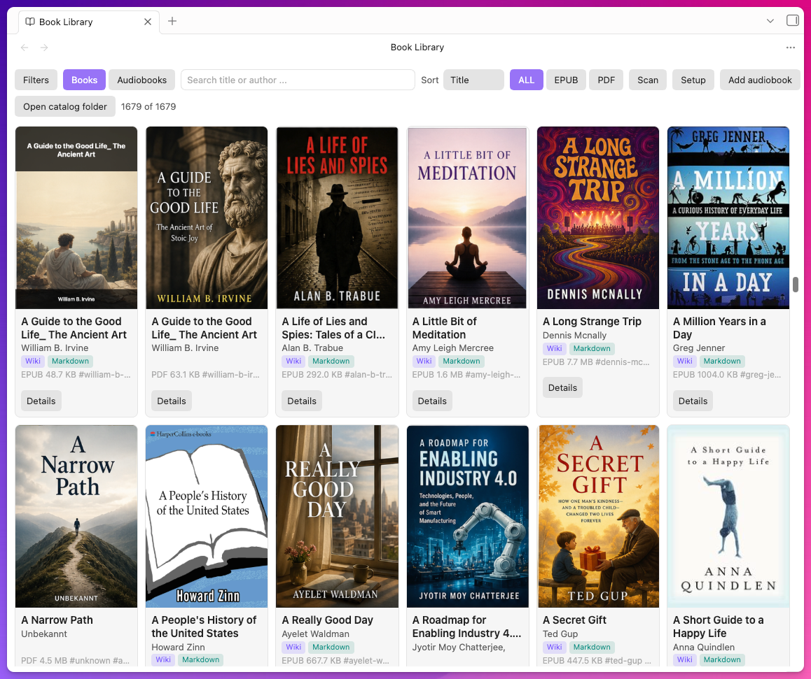
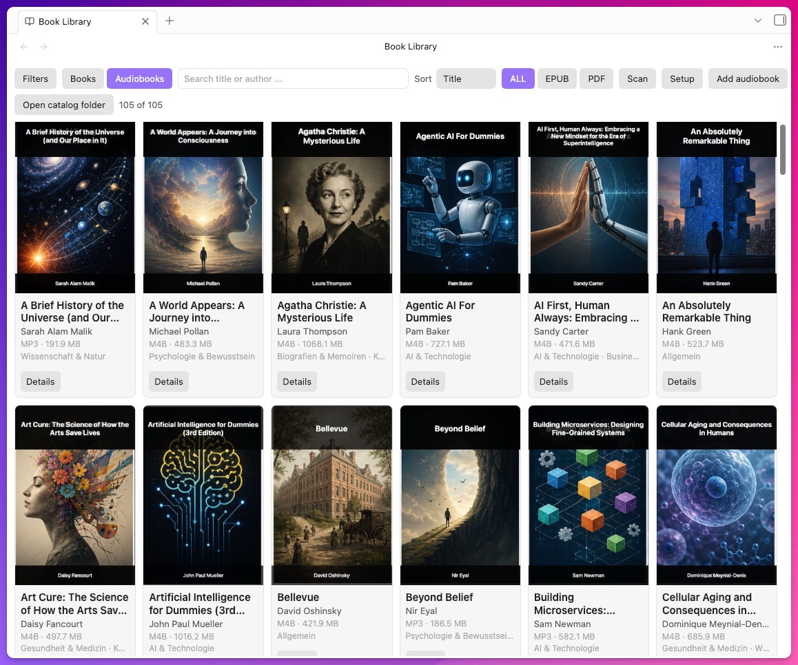

<p align="center">
  
</p>

<p align="center">
  <strong>Lokale Bücher und Audiobooks als vernetzte Obsidian-Bibliothek.</strong><br>
  <strong>Turn local books and audiobooks into a connected Obsidian library.</strong>
</p>

<p align="center">
  <a href="#deutsch">Deutsch</a> · <a href="#english">English</a> · <a href="https://obsidian-book-library.pages.dev/">Landingpage</a> · <a href="https://github.com/MediaPublishing/book-library/releases">Releases</a>
</p>

## Screenshots

### Bücher / Books



### Audiobooks



---

## Deutsch

Book Library verwandelt lokale EPUB-, PDF- und Audiobook-Ordner in eine durchsuchbare Obsidian-Bibliothek. Das Plugin erstellt lesbare Katalognotizen mit Covers, Synopsen, Quellenlinks, verwandten Büchern und Themen. Deine Mediendateien bleiben an ihrem ursprünglichen Speicherort.

### Funktionen

- Inkrementeller Scan für EPUB- und PDF-Dateien.
- Lokaler Audiobook-Index für M4A, M4B, MP3, FLAC, OGG, Opus, WAV und AAC.
- Einheitliche Detailansicht für Bücher und Audiobooks mit Cover, Beschreibung, Ratings und belegten Rezensionen.
- Automatische Audiobook-Anreicherung über öffentliche Buchquellen; vorhandene lokale Daten haben Vorrang.
- Lesbare Katalognotizen statt Hash-Dateinamen.
- Covers aus eingebetteten Dateien, Open Library oder Google Books.
- EPUB-zu-Markdown-Konvertierung.
- Verwandte Bücher und Themen aus Autor, Kategorie, Tags und Metadaten.
- Optionale AI-Workflows für Themen-Wikis und Cover-Generierung.
- Lokale Pfade, Web-URLs, Cloud-Ordner und private Ablage-Links.
- Keine Telemetrie. Externe Dienste sind optional und müssen bewusst aktiviert werden.

### Installation

1. Lade [Book Library 0.7.7](https://obsidian-book-library.pages.dev/download/book-library-0.7.7.zip) herunter.
2. Entpacke das ZIP.
3. Kopiere `main.js`, `manifest.json` und `styles.css` nach:

   ```text
   <Vault>/.obsidian/plugins/book-library/
   ```

4. Aktiviere **Book Library** unter **Einstellungen → Community-Plugins** in Obsidian.

### Schnellstart

1. Starte **Bibliothek einrichten** oder öffne **Setup** in der Bibliotheksansicht.
2. Wähle deinen Buchordner und optional einen Audiobook-Ordner.
3. Prüfe Sprache und Detailanzeige.
4. Starte die Indexierung und kontrolliere die Zusammenfassung.
5. Lade fehlende Covers zuerst über die kostenlosen Quellen nach.
6. Aktiviere AI-Workflows nur für die gewünschten Bücher und mit einem festgelegten Budget.

Wenn Titel, Autoren oder Beschreibungen fehlerhafte Zeichen wie `&amp;`, `` oder HTML-Fragmente enthalten, führe **Metadaten-Textkodierung reparieren** über die Obsidian-Befehlspalette aus. Ersetzte Katalogdateien werden archiviert und nicht gelöscht.

### AI und Datenschutz

Die lokale Indexierung funktioniert ohne AI-Dienst. Metadaten und Covers können über öffentliche Buch-APIs ergänzt werden. AI-Wikis und AI-Covers sind optional und erfordern eine eigene Provider-Konfiguration. Weitere Details stehen in [PRIVACY.md](PRIVACY.md).

---

## English

Book Library turns local EPUB, PDF and audiobook folders into a searchable Obsidian library. The plugin creates readable catalog notes with covers, synopses, source links, related books and topics. Your media files stay in their original storage location.

### Features

- Incremental scanning for EPUB and PDF files.
- Local audiobook index for M4A, M4B, MP3, FLAC, OGG, Opus, WAV and AAC.
- One consistent detail view for books and audiobooks, including cover, description, ratings and sourced reviews.
- Automatic audiobook enrichment through public book sources; existing local data takes precedence.
- Readable catalog notes instead of hash filenames.
- Covers from embedded files, Open Library or Google Books.
- EPUB-to-Markdown conversion.
- Related books and topics from authors, categories, tags and metadata.
- Optional AI workflows for topic wikis and cover generation.
- Local paths, web URLs, cloud folders and private storage links.
- No telemetry. External services are optional and must be enabled deliberately.

### Installation

1. Download [Book Library 0.7.7](https://obsidian-book-library.pages.dev/download/book-library-0.7.7.zip).
2. Unzip the archive.
3. Copy `main.js`, `manifest.json` and `styles.css` to:

   ```text
   <Vault>/.obsidian/plugins/book-library/
   ```

4. Enable **Book Library** under **Settings → Community plugins** in Obsidian.

### Quick start

1. Run **Set up library** or open **Setup** in the library view.
2. Choose your book folder and, optionally, an audiobook folder.
3. Review the language and detail-display settings.
4. Start indexing and check the completion summary.
5. Fetch missing covers from the free sources first.
6. Enable AI workflows only for the books you choose and with a defined budget.

If titles, authors or descriptions contain broken entities such as `&amp;`, `` or HTML fragments, run **Repair metadata text encoding** from the Obsidian command palette. Superseded catalog files are archived rather than deleted.

### AI and privacy

Local indexing works without an AI service. Metadata and covers can be enriched through public book APIs. AI wikis and AI covers are optional and require your own provider configuration. See [PRIVACY.md](PRIVACY.md) for details.

---

## Entwicklung / Development

```bash
npm install
npm test
npm run typecheck
npm run build
```

Die CI führt dieselben Prüfungen bei jedem Push und Pull Request aus. Ein `v*`-Tag startet die Release-Pipeline und veröffentlicht das passende ZIP mit Prüfsummen.

CI runs the same checks on every push and pull request. A `v*` tag starts the release pipeline and publishes the matching ZIP with checksums.

Aktuelle Version / Current release: **0.7.7**<br>
Lizenz / License: **MIT**
